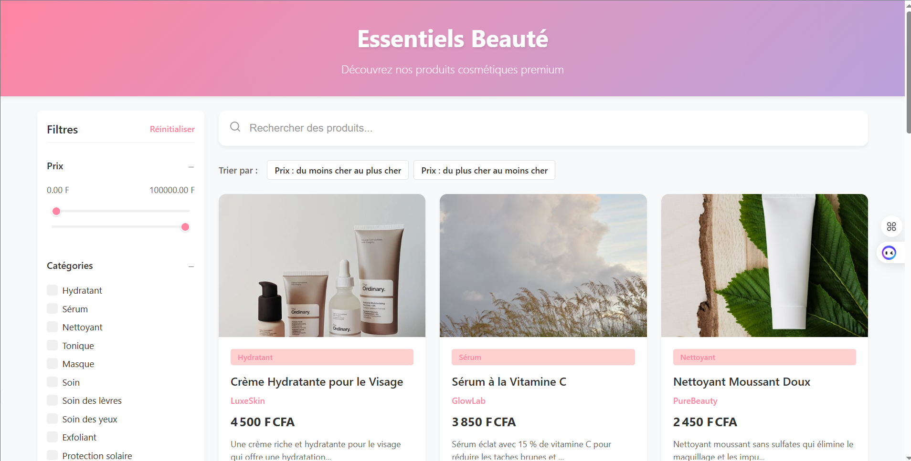

# 📘 Catalogue de Produits Cosmétiques

Une application moderne et interactive développée avec **Vue 3**, **TypeScript** et **Vite**, permettant de parcourir une collection de produits cosmétiques avec des fonctionnalités avancées de recherche, tri et filtrage.

## Fonctionnalités

- 🎨 Design moderne et réactif avec animations fluides  
- 🔍 Recherche en temps réel  
- 🧰 Système de filtres avancés  
  - Par catégorie  
  - Par tranche de prix  
  - Par marque  
- 💰 Tri des produits selon le prix (croissant/décroissant)  
- 🖼️ Fiches produit dynamiques avec effets au survol  
- 📱 Interface responsive adaptée aux mobiles  
- 🎯 Sécurité typée grâce à TypeScript  
- ⚡ Vite pour un développement ultra rapide

## Structure du Projet

```
src/
├── components/            # Composants Vue
│   ├── Filtre.vue         # Interface de filtrage
│   ├── Carte_produits.vue       # Affichage individuel d’un produit
│   ├── Grid_produits.vue     # Disposition en grille
│   ├── Recherche.vue     # Barre de recherche
│   └── Controls.vue        # Contrôles de tri
├── services/             # Logique métier
│   └── produitService.ts      # Service de gestion des produits
├── types/                # Définitions des types TypeScript
│   └── index.ts
├── data/                 # Données factices
│   └── Produits.ts
└── App.vue               # Composant racine
```

## Détails Techniques

### Composants

#### App.vue  
- Composant racine gérant la disposition globale  
- Gère l’affichage conditionnel des filtres sur mobile  
- Implémente une mise en page adaptative

#### PanneauFiltres.vue  
- Gère les filtres produits  
- Curseur pour la tranche de prix  
- Sélection dynamique des catégories et marques  
- État réactif pour les changements de filtre

#### CarteProduit.vue  
- Affiche les informations d’un produit  
- Effets visuels lors du survol  
- Chargement progressif des images  
- Adapté à tous les formats d’écran

#### GrilleProduits.vue  
- Affichage en grille responsive  
- Gère l’état vide si aucun produit ne correspond  
- Grille fluide avec media queries

#### BarreRecherche.vue  
- Champ de recherche réactif et animé  
- Possibilité d’effacer la requête saisie

#### ControleTri.vue  
- Boutons de tri par prix  
- Basculer entre croissant/décroissant  
- Réinitialiser le tri

### Services

#### serviceProduit.ts  
- Service centralisé de gestion des produits  
- Implémente les logiques de filtre, recherche et tri  
- Gère l’état global des filtres et produits

### Gestion de l’État

- Basée sur l’API de Composition de Vue 3  
- Réactivité native avec `ref` et `computed`  
- Propriétés calculées pour les produits filtrés  
- `watch` pour déclencher les mises à jour en temps réel

### Styles

- Variables CSS personnalisées pour le thème  
- Disposition responsive mobile-first  
- Transitions et animations CSS douces  
- Points de rupture adaptés à toutes les tailles d’écran

## Mise en Route

1. Installation des dépendances :
   ```bash
   npm install
   ```

2. Lancement du serveur de développement :
   ```bash
   npm run dev
   ```

3. Génération du build de production :
   ```bash
   npm run build
   ```

## Système de Design

### Couleurs

- Primaire : `#FF85A2` (Rose)  
- Secondaire : `#B9A2DB` (Violet)  
- Accent : `#65C0BA` (Vert d’eau)  
- Texte foncé : `#333333`  
- Texte moyen : `#666666`  
- Texte clair : `#999999`  
- Fond : `#F8F9FA`

### Typographie

- Police : Inter, system-ui  
- Titres : de 1.2rem à 2.2rem  
- Texte : de 0.9rem à 1rem  
- Graisses : 400 (normal), 500 (moyen), 600 (semi-gras), 700 (gras)

### Espacements

- Unité de base : 4px  
- Marges : 8px, 16px, 24px, 32px  
- Rembourrages : 8px, 16px, 20px, 24px

### Animations

- Transitions : de 0.2s à 0.5s  
- Courbes : `cubic-bezier(0.4, 0, 0.2, 1)`  
- Effets : fondu, glissement, mise à l’échelle

### Points de rupture

- Mobile : < 640px  
- Tablette : 640px - 1024px  
- Bureau : > 1024px

## Optimisations de Performance

- Chargement paresseux des images  
- Recherche avec délai (debounce)  
- Animations optimisées  
- Images adaptatives  
- Algorithmes de filtrage efficaces

## Accessibilité

- Labels ARIA  
- Navigation clavier  
- Gestion du focus  
- Contraste de couleurs conforme  
- Support des lecteurs d’écran

## Améliorations futures

- Page de détails produit  
- Fonction de favoris (wishlist)  
- Filtres avancés combinés  
- Avis et évaluations utilisateurs  
- Partage sur les réseaux  
- Mode sombre


